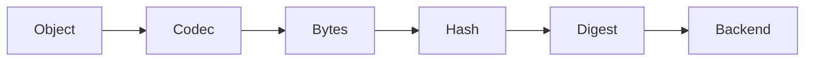

# CASK

<div class="hero-box">
  <h1>Content-addressable storage for Go</h1>
  <p>Store objects by content hash, not by location. Keep object identity, hashing, serialization, and storage independent so you can build a durable, typed object layer without re-inventing the plumbing.</p>
  <p>
    <a class="md-button md-button--primary" href="getting-started.md">Get started</a>
    <a class="md-button" href="https://github.com/dmundt/go-cask">View on GitHub</a>
    <a class="md-button" href="https://pkg.go.dev/github.com/dmundt/go-cask">Latest Go docs</a>
  </p>
  <div class="hero-badges">
    <span>Pure Go</span>
    <span>Content-addressable</span>
    <span>Pluggable codecs</span>
    <span>Flexible backends</span>
  </div>
</div>

## What is go-cask?

`go-cask` is a Go library for content-addressable storage. The object identity is the digest of its content, not a mutable filename or database row. That gives you stable references, automatic deduplication, and a clean separation between object identity and verification.

## Why use it?

Traditional storage systems usually bind an object to a path, a row, or a mutable pointer. That makes duplication, integrity checks, and reference tracking harder than they need to be.

With `go-cask`, the flow is simple:

```go
store, _ := cask.Open(...)
ref, _ := store.Put(ctx, user)
var loaded User
_ = store.Get(ctx, ref, &loaded)
```

### Problem → solution

- File names are not object identities.
- Database rows are not durable content references.
- Application objects change frequently; storage should not.

`go-cask` makes object identity explicit:



You get:

- automatic deduplication
- stable, portable references
- explicit integrity checks
- a backend layer you can swap without changing the app model

## Architecture at a glance

```mermaid
flowchart TB
    A[Application code] --> B[Typed object model]
    B --> C[Codec[T]]
    C --> D[Bytes]
    D --> E[Hash]
    E --> F[Digest]
    F --> G[Backend]
```

## Design goals

Built for:

- content-addressable storage
- deterministic object identity
- maintainable type layering
- storage abstraction without application lock-in

Not intended for:

- relational data models
- distributed consensus
- general-purpose version control

## Feature set

<div class="feature-grid">
  <div class="feature-card">
    <h3>Content addressing</h3>
    <p>Hash identifies the content, not the location.</p>
  </div>
  <div class="feature-card">
    <h3>Pluggable hashes</h3>
    <p>Use SHA-256, SHA-512/256, or provide your own hasher.</p>
  </div>
  <div class="feature-card">
    <h3>Pluggable codecs</h3>
    <p>Serialize Go values with JSON, CBOR, or a custom codec.</p>
  </div>
  <div class="feature-card">
    <h3>Multiple backends</h3>
    <p>Use the filesystem backend, memory backend, or build your own.</p>
  </div>
  <div class="feature-card">
    <h3>Strong integrity</h3>
    <p>Verify content explicitly without mixing identity and validation rules.</p>
  </div>
  <div class="feature-card">
    <h3>Pure Go</h3>
    <p>Keep the core library simple and portable.</p>
  </div>
</div>

## Start here

```bash
go get github.com/dmundt/go-cask
```

Then read the docs and run the examples.

## Documentation map

- [Getting started](getting-started.md)
- [Architecture](architecture.md)
- [Concepts](concepts/index.md)
- [Specification set](specs.md)
- [Latest Go docs](https://pkg.go.dev/github.com/dmundt/go-cask)
- [GitHub repository](https://github.com/dmundt/go-cask)

<div class="cta-box">
  <strong>Ready to try go-cask?</strong>
  <p><a href="getting-started.md">Getting started →</a></p>
</div>
