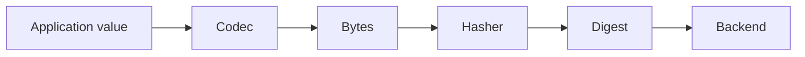

# go-cask

<div class="page-topbar">
  <span class="brand">go-cask</span>
  <nav class="top-links">
    <a href="getting-started.md">Docs</a>
    <a href="specs.md">Specs</a>
    <a href="recipes/custom-codec.md">Recipes</a>
    <a href="#benchmarks">Benchmarks</a>
    <a href="https://github.com/dmundt/go-cask">GitHub</a>
  </nav>
</div>

<div class="landing-hero">
  <div class="hero-copy">
    <p class="eyebrow">go-cask</p>
    <h1>Content-addressable storage for Go.</h1>
    <p class="lead">
      Store values by content hash, not by filename. go-cask gives Go code stable references,
      integrity checks, and a storage boundary that stays independent from application logic.
    </p>
    <div class="hero-actions">
      <a class="md-button md-button--primary" href="getting-started.md">Get started</a>
      <a class="md-button" href="https://github.com/dmundt/go-cask">View on GitHub</a>
    </div>
    <div class="hero-badges">
      <span>Pure Go</span>
      <span>Content-addressable</span>
      <span>Streaming-friendly</span>
      <span>Multiple backends</span>
      <span>Deterministic identity</span>
    </div>
    <div class="hero-callout">
      Built for object graphs, caches, artifacts, and any workflow where content identity matters
      more than file paths.
    </div>
  </div>

  <div class="hero-code">
    <pre><code>store, _ := cask.Open(...)

ref, _ := store.Put(ctx, obj)

var loaded User
_ = store.Get(ctx, ref, &loaded)</code></pre>
  </div>
</div>

<div class="two-column">
  <div class="mini-panel good-panel">
    <h3>Use go-cask when</h3>
    <ul>
      <li>content identity matters more than a filename</li>
      <li>you want stable references across storage changes</li>
      <li>integrity checks and deduplication matter</li>
      <li>you need a backend abstraction without a database</li>
    </ul>
  </div>
  <div class="mini-panel bad-panel">
    <h3>Use a database when</h3>
    <ul>
      <li>you need relational queries and joins</li>
      <li>you need transactional updates</li>
      <li>you need mutable records with indexing and ad hoc queries</li>
      <li>you need distributed consensus or multi-writer coordination</li>
    </ul>
  </div>
</div>

## Why go-cask?

The core idea is simple: content identifies the object, not a filename or mutable path. That gives Go code stable references, automatic deduplication, and a clear integrity story that survives renames and storage churn.

<div class="feature-grid feature-hierarchy">
  <div class="feature-card feature-primary fingerprint">
    <div class="feature-icon">
      <svg viewBox="0 0 24 24" aria-hidden="true"><path d="M12 3a9 9 0 1 1 0 18a9 9 0 0 1 0-18Zm0 3.5a5.5 5.5 0 1 0 0 11a5.5 5.5 0 0 0 0-11Zm0 2.2a3.3 3.3 0 0 1 3.3 3.3a3.3 3.3 0 0 1-3.3 3.3a3.3 3.3 0 0 1-3.3-3.3A3.3 3.3 0 0 1 12 8.7Zm0-5.2v2.2M12 18.3v2.2M5.7 12H3.5m16.5 0h-2.2" /></svg>
    </div>
    <h3>Content addressing</h3>
    <p>Stable identity from bytes, not filenames. The same content resolves to the same reference.</p>
  </div>
  <div class="feature-card feature-primary database">
    <div class="feature-icon">
      <svg viewBox="0 0 24 24" aria-hidden="true"><path d="M4 6.5C4 5.1 7.1 4 12 4s8 1.1 8 2.5S16.9 9 12 9S4 7.9 4 6.5Zm0 5.5c0 1.4 3.1 2.5 8 2.5s8-1.1 8-2.5M4 6.5V17.5C4 18.9 7.1 20 12 20s8-1.1 8-2.5V6.5" /></svg>
    </div>
    <h3>Storage backends</h3>
    <p>Keep your object model while swapping filesystem, memory, or custom backends.</p>
  </div>
  <div class="feature-card puzzle">
    <div class="feature-icon">
      <svg viewBox="0 0 24 24" aria-hidden="true"><path d="M9.5 4.5a2 2 0 0 1 2 2V7h1v-.5a2 2 0 1 1 4 0V8a2 2 0 0 1-2 2h-.5v1h.5a2 2 0 0 1 2 2v.5a2 2 0 1 1-4 0V15h-1v.5a2 2 0 1 1-4 0V15a2 2 0 0 1 2-2h.5v-1H9.5a2 2 0 0 1-2-2V8a2 2 0 1 1 4 0v.5H9.5V7h1.5V6.5a2 2 0 0 1 2-2Z" /></svg>
    </div>
    <h3>Pluggable codecs</h3>
    <p>CBOR, JSON, MsgPack, or your own encoding layer when the object format matters.</p>
  </div>
  <div class="feature-card hash">
    <div class="feature-icon">
      <svg viewBox="0 0 24 24" aria-hidden="true"><path d="M8 4v4H4v3h4v6H4v3h4v4h3v-4h6v4h3v-4h4v-3h-4v-6h4V8h-4V4h-3v4h-6V4Zm3 7h6v6h-6Z" /></svg>
    </div>
    <h3>Hash algorithms</h3>
    <p>Choose SHA-256, SHA-512, BLAKE3, or a custom hasher for your trust model.</p>
  </div>
  <div class="feature-card shield">
    <div class="feature-icon">
      <svg viewBox="0 0 24 24" aria-hidden="true"><path d="M12 3.5 5 6v5.5c0 4.2 2.7 7.9 7 9.5c4.3-1.6 7-5.3 7-9.5V6Zm-1.5 7.5 1.5 1.5 3.5-3.5" /></svg>
    </div>
    <h3>Integrity verification</h3>
    <p>Keep object identity and validation explicit so corrupted payloads are easy to detect.</p>
  </div>
  <div class="feature-card package">
    <div class="feature-icon">
      <svg viewBox="0 0 24 24" aria-hidden="true"><path d="M12 3.5 4 7.5v9l8 4 8-4v-9Zm0 0v17m8-13.5-8-4-8 4" /></svg>
    </div>
    <h3>Pure Go</h3>
    <p>No CGO dependencies. The library stays portable and familiar to Go teams.</p>
  </div>
</div>

<div class="two-column">
  <div class="mini-panel good-panel">
    <h3>Built for</h3>
    <ul>
      <li>stable object graphs</li>
      <li>verifiable payloads</li>
      <li>backend abstraction</li>
      <li>content-addressed caches and artifacts</li>
    </ul>
  </div>
  <div class="mini-panel bad-panel">
    <h3>Not built for</h3>
    <ul>
      <li>relational queries</li>
      <li>distributed consensus</li>
      <li>full version control</li>
      <li>database replacement</li>
    </ul>
  </div>
</div>

## Why choose go-cask over rolling your own?

Most Go projects eventually build this pattern by hand: hash bytes, keep stable references, verify integrity, and abstract storage. go-cask packages that design in one place so your application can focus on data semantics instead of plumbing.

If you need a stable identifier for content, a portable reference across storage layouts, or an integrity check that survives renames and churn, go-cask is a better fit than file-name-based storage plus bespoke blob handling.

- Stable object identity across renames and storage churn
- Portable references that are easy to validate and persist
- A clear boundary between object encoding, hashing, and storage
- A backend abstraction that works across local and custom storage layouts

## How it works

<div class="pipeline-box">
  <div class="pipeline-step">Object</div>
  <div class="pipeline-arrow">↓</div>
  <div class="pipeline-step">Codec</div>
  <div class="pipeline-arrow">↓</div>
  <div class="pipeline-step">Hash</div>
  <div class="pipeline-arrow">↓</div>
  <div class="pipeline-step">Reference</div>
  <div class="pipeline-arrow">↓</div>
  <div class="pipeline-step">Storage</div>
</div>



The model is simple: encode the value, hash the bytes, keep the digest as the identity, and store the payload behind a backend interface.

## Core concepts

<div class="feature-grid four-up">
  <div class="feature-card">
    <h3><a href="concepts/index.md">Objects</a></h3>
    <p>Store arbitrary Go values with explicit type boundaries and clear object semantics.</p>
  </div>
  <div class="feature-card">
    <h3><a href="concepts/content-addressing.md">References</a></h3>
    <p>Stable identifiers derived from content instead of mutable paths or row keys.</p>
  </div>
  <div class="feature-card">
    <h3><a href="concepts/codecs.md">Codecs</a></h3>
    <p>CBOR, MsgPack, JSON, and custom encodings tailored to your object model.</p>
  </div>
  <div class="feature-card">
    <h3><a href="concepts/backends.md">Backends</a></h3>
    <p>Filesystem, memory, or a backend you implement for your runtime and durability needs.</p>
  </div>
</div>

## Example workflow

1. Create an object
2. Serialize it
3. Generate a digest
4. Store the data
5. Retrieve by reference
6. Verify integrity

```go
obj := User{Name: "Ada", Role: "Engineer"}
ref, _ := store.Put(ctx, obj)

var loaded User
_ = store.Get(ctx, ref, &loaded)
_ = store.Verify(ctx, ref)
```

This gives you a clear, auditable flow from value to durable, verifiable content-addressed storage.

## Feature grid

<div class="feature-grid feature-grid-compact">
  <div class="feature-card">
    <h3>Content addressing</h3>
    <p>Content is identified by hash.</p>
  </div>
  <div class="feature-card">
    <h3>Pluggable hashes</h3>
    <p>SHA-256, SHA-512, custom algorithms.</p>
  </div>
  <div class="feature-card">
    <h3>Multiple codecs</h3>
    <p>JSON, CBOR, MsgPack, custom encodings.</p>
  </div>
  <div class="feature-card">
    <h3>Storage backends</h3>
    <p>Memory, filesystem, custom implementations.</p>
  </div>
  <div class="feature-card">
    <h3>Streaming I/O</h3>
    <p>Work efficiently with large payloads.</p>
  </div>
  <div class="feature-card">
    <h3>Pure Go</h3>
    <p>Portable, simple, and familiar to Go teams.</p>
  </div>
</div>

## Why not X?

| Tool | Focus | go-cask |
|---|---|---|
| Filesystem | location-based storage | content-addressable storage library |
| SQLite | relational database | object identity and integrity-first storage |
| Git | version control | reusable storage primitives and object graph model |
| IPFS | distributed content network | local library and backend abstraction |

`go-cask` is designed for stable, verifiable object storage and typed object graphs, not for full relational or distributed consensus workloads.

## Benchmarks

Benchmark the hot paths that matter to your workload: hashing, encoding, storage overhead, and lookup latency. The goal is a credible engineering story grounded in your environment, not a universal speed claim.

<div class="benchmark-grid">
  <div class="benchmark-card">
    <div class="benchmark-label">Hash throughput</div>
    <div class="benchmark-value">Measure</div>
    <div class="benchmark-meta">SHA-256, SHA-512, BLAKE3, or custom</div>
  </div>
  <div class="benchmark-card">
    <div class="benchmark-label">Codec performance</div>
    <div class="benchmark-value">Measure</div>
    <div class="benchmark-meta">JSON, CBOR, MsgPack, or custom</div>
  </div>
  <div class="benchmark-card">
    <div class="benchmark-label">Storage overhead</div>
    <div class="benchmark-value">Measure</div>
    <div class="benchmark-meta">Payload size, layout, backend cost</div>
  </div>
  <div class="benchmark-card">
    <div class="benchmark-label">Lookup speed</div>
    <div class="benchmark-value">Measure</div>
    <div class="benchmark-meta">Local or remote backend, warm vs cold</div>
  </div>
</div>

When the benchmark is tied to a real workload, it becomes useful. That is the standard this project aims for.

## Design goals

<div class="two-column">
  <div class="mini-panel good-panel">
    <h3>Goals</h3>
    <ul>
      <li>Simplicity</li>
      <li>Predictability</li>
      <li>Extensibility</li>
      <li>Long-term compatibility</li>
      <li>Strong integrity guarantees</li>
    </ul>
  </div>
  <div class="mini-panel bad-panel">
    <h3>Non-goals</h3>
    <ul>
      <li>Distributed consensus</li>
      <li>Database replacement</li>
      <li>ORM layering</li>
      <li>Version control</li>
    </ul>
  </div>
</div>

## Specifications

This is where the project gains authority. The technical documentation is not just examples; it explains the contract itself:

<div class="spec-panel">
  <div class="spec-item"><span>Object format</span></div>
  <div class="spec-item"><span>Reference format</span></div>
  <div class="spec-item"><span>Digest format</span></div>
  <div class="spec-item"><span>Codec interface</span></div>
  <div class="spec-item"><span>Backend interface</span></div>
  <div class="spec-item"><span>Compatibility rules</span></div>
</div>

See the [specification docs](specs.md) and [architecture overview](architecture.md).

## Recipes

Practical examples generate the most engagement:

- filesystem backend
- memory backend
- custom codec
- custom hash
- content verification
- caching layer

Browse the [Recipes](recipes/custom-codec.md) and [Getting started](getting-started.md) guides.

## Ready to use go-cask?

<div class="cta-box">
  <strong>go get github.com/dmundt/go-cask</strong>
  <div class="hero-actions">
    <a class="md-button md-button--primary" href="getting-started.md">Getting started</a>
    <a class="md-button" href="specs.md">Read the specs</a>
    <a class="md-button" href="https://github.com/dmundt/go-cask">GitHub</a>
  </div>
  <p>Start with a small object store, then move into custom codecs, hashing, and backend selection as your workload grows.</p>
</div>

## Footer

- [Docs](getting-started.md)
- [Specs](specs.md)
- [Recipes](recipes/custom-codec.md)
- [GitHub](https://github.com/dmundt/go-cask)
- [pkg.go.dev](https://pkg.go.dev/github.com/dmundt/go-cask)
- MIT License
