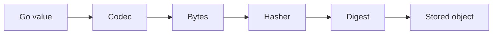

# Object format

The object format is intentionally small: a Go value is serialized to bytes, the bytes are digested, and the digest becomes the stable object key.

## Core pattern

- bytes are stored under a digest
- a typed object defines how those bytes are interpreted
- a codec converts a Go value to bytes and back
- the storage layer remains generic and does not know the application type

## The flow

## Good defaults

- JSON for readable metadata
- CBOR or another binary codec for compact payloads
- compression wrappers when size matters more than readability

## Compatibility principle

The project keeps the core lean and explicit. Stable object semantics matter more than a broad set of hidden assumptions.
