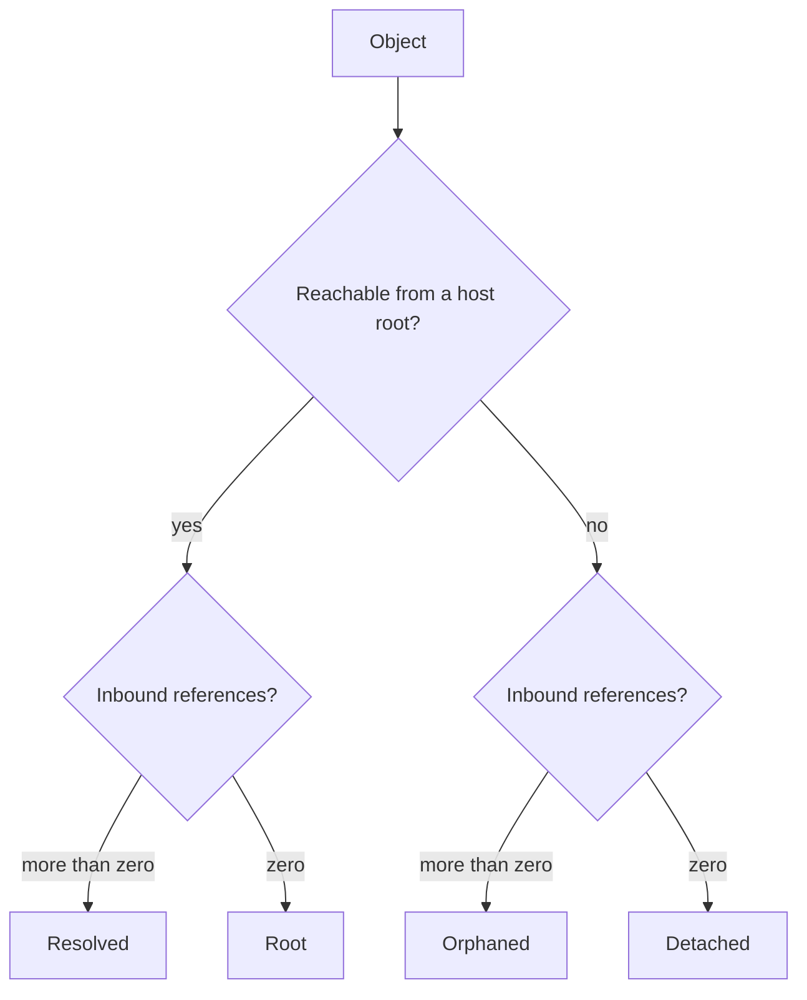

# The viewer (`cask web`)

`cask web` starts the embedded viewer: a server-rendered object browser that
answers "what is stored here, how large is it, and is this object still the
bytes its address claims?". It binds to loopback, requires a login, and serves
HTML — the only script it ships is vendored htmx, and its only presentation
asset is one scoped stylesheet. No JSON API is exposed.

The viewer is a byte-layer tool. It reads objects, their envelope type, their
exact size, their bytes, and on-demand integrity results. It never resolves
typed references and never imports an application object model, so what it
shows is the store, not your vocabulary for it.

- Normative design: [viewer-design.md](https://github.com/dmundt/go-cask/blob/main/docs/specs/viewer-design.md)
- Security requirements: [viewer-security.md](https://github.com/dmundt/go-cask/blob/main/docs/specs/viewer-security.md)
- Server wiring and config: [backend-architecture.md](https://github.com/dmundt/go-cask/blob/main/docs/specs/backend-architecture.md)
- Flag contract: [cli.md](https://github.com/dmundt/go-cask/blob/main/docs/specs/cli.md)
- Rendering and htmx model: [frontend-architecture.md](https://github.com/dmundt/go-cask/blob/main/docs/specs/frontend-architecture.md)

## Starting it

```text
cask web -store ./objects \
  -backend fs \
  -bind 127.0.0.1:8080 \
  -hash-algo sha256 \
  -tokens viewer=…,operator=…,admin=…
```

| Flag | Meaning |
|---|---|
| `-store <dir>` | The store directory to serve. Defaults to the global `-store`, then `./objects`. |
| `-backend fs` | The viewer needs the filesystem backend, because it reads per-object physical metadata (size, modification time) through it. Any other backend is refused with an error naming the operation and the backend, rather than reading a different directory than `-store` named. |
| `-bind <addr>` | Listen address, `127.0.0.1:8080` by default. |
| `-hash-algo sha256\|sha512\|sha512_256` | The digest algorithm used to parse, validate, and re-digest objects. It is displayed in the inspector under Metadata → Identity. |
| `-tokens role=token,…` | Per-role login tokens: comma-separated `role=token` pairs, where `role` is `viewer`, `operator`, or `admin`. Empty entries and empty tokens are ignored, so a misconfigured pair cannot grant a role to the empty string. |
| `-token-file <path>` | A file holding the startup admin token. Its trimmed contents become the token; an empty file is a startup error. The value is never echoed. |
| `-trusted-proxy <ip\|cidr,…>` | Reverse proxies whose forwarded client address the login throttle may believe. Empty — the default — believes none, so the throttle keys on the direct peer. A malformed entry fails startup. |
| `-allow-insecure-bind` | Permits a non-loopback bind. Without it, `cask web` refuses to start on a non-loopback address. |
| `-no-open` | Do not launch the default browser. |

There is no config file: flags only. `cask web` is also the only way to enable
the viewer — the process log and the store are untouched until the subcommand
runs.

### The startup token

The viewer needs at least one credential before it can serve anything. The
startup token grants the `admin` role, and it is resolved in this order:

1. `-token-file <path>` — read first, used exactly as stored (trimmed).
2. `CASK_VIEWER_TOKEN` — used when no `-token-file` was given.
3. Generated for this run from `crypto/rand` (6 bytes, rendered as three
   uppercase dash-separated hex groups). It is regenerated on every restart
   unless the operator supplied one.

An operator-supplied token is never displayed. A generated token is shown once
on stderr — never through the logging package at any level — and only when
stderr is an interactive terminal. When a generated token cannot be shown, the
viewer logs the remedy instead of the token: supply one with `-token-file` or
`CASK_VIEWER_TOKEN`. That is the shape an unattended deployment wants, because
under systemd, Docker, or a log shipper, anything sent to the logger is
retained and indexed beyond the operator.

Sign in one of two ways:

- Open `http://127.0.0.1:8080/viewer/` and submit the token on the login page.
- Follow `http://127.0.0.1:8080/viewer/?token=<token>` — the deep link
  `cask web` opens in the browser unless `-no-open` was given.

Both accept a token only from the viewer's own origin; a cross-site request
carrying a valid token is refused with `403` and an empty body. The token URL
is one-time: after login the session cookie carries the session, and neither
the token nor any secret reaches markup or logs.

### Sessions, roles, and exposure

A session lasts at most 30 idle minutes and 8 hours total, and disappears when
the viewer restarts. Session cookies are always `HttpOnly`, `SameSite=Strict`,
and `Secure`; none of those can be turned off. The practical consequence of
`Secure` is that plain `http://` logins do not hold a session, so a non-loopback
bind is only usable behind a TLS-terminating proxy — the viewer warns about
exactly that when you override the loopback default.

| Role | May |
|---|---|
| `viewer` | List and browse objects, inspect metadata and references, read an object's preview bytes |
| `operator` | Everything `viewer` may, plus verify one object and verify every object in one sweep |
| `admin` | Everything `operator` may |

Destructive operations are deliberately absent. Deleting an object and
garbage collection belong to the CLI, where they can be scripted and paired
with the roots a sweep needs; the viewer exposes no delete or GC route, and a
path it never served answers on your session (401 without one, 404 with) rather
than on the path.

Login failures are throttled at five per caller address per minute with
backoff, and every failure is audited without the submitted token. The caller
address is the direct TCP peer unless the peer is a configured `-trusted-proxy`
and forwarded it — with no trusted proxy configured, every client behind a
reverse proxy shares one bucket, so five failures from one client can lock out
all operators. If you put the viewer behind a proxy, configure `-trusted-proxy`
with that proxy's address.

## What an operator sees

The object browser is the viewer's landing page and its only operational
workspace. It is a master-detail layout: a filter bar, an object table with a
pager, and an inspector for the object currently selected.

The filter bar offers search (digest prefix or type, as you type), type, size
band, integrity, and — when the host supplies the indexes described below — a
`References` filter. The table renders one row per **stored object**, with
these columns:

| Column | Content |
|---|---|
| `Hash` | The digest prefix, first eight hex characters plus `…` |
| `Type` | The envelope type, or `unreadable` when the bytes could not be read |
| `Size` | The stored size in base-1024 IEC units (`B`, `KiB`, `MiB`, `GiB`, `TiB`) |
| `Inbound` | The number of objects the host-supplied reference index reports as pointing here |
| `Integrity` | `Unverified`, `Verified`, or `Corrupt` — the session's verification result |
| `References` | The reference state (`Resolved`, `Root`, `Orphaned`, or `Detached`); present only when the host supplies a reachability index |
| `Written` | The physical write time, rendered as elapsed whole minutes, hours, or days — for example `59m ago`, `3h ago`, `2d ago` |

Every column sorts, including the two state columns. Filter, sort, page,
selection, and inspector panel all live in the URL, so a view can be bookmarked,
shared, or reloaded:

```text
/viewer/objects?q=&type=&size=&status=&reach=
  &sort=hash|type|size|inbound|status|reach|written&dir=asc|desc
  &limit=25|50|100|250&offset=<n>&selected=<digest>&tab=metadata|references|bytes
```

Defaults are hash ascending, 25 rows, no filters, and the Metadata panel.
Invalid enumerations, malformed digests, and negative offsets return `400`
rather than being silently corrected. The one exception is `limit`, which is a
preference rather than a claim about the store: an out-of-range numeric limit
is clamped and the Rows control names the size actually in effect.

The table shows exactly what the store says. It does not fabricate reference
counts, object age, or stored verification state.

## Inspecting an object

Selecting a row opens the inspector on the right. It has three panels.

### Metadata

- **Identity** — the digest algorithm and the object's envelope type.
- **Storage** — the exact size in bytes, the physical `Written` age, and the
  same value as a UTC RFC 3339 `Timestamp`. Neither is an immutable logical
  creation timestamp.
- **State** — the integrity verdict with the time of the last check, the
  reference state, and the inbound-reference count. The full digest sits above
  the panels in a readonly field, which is the selection target that replaces a
  copy-to-clipboard button — the viewer ships no clipboard script.

### References

When the host supplies a reference index, this panel lists the object's
deterministic digest-sorted inbound and outbound edges, each a selectable link
that names the other object's stored envelope type. Without an index, both
lists render their empty state, and the viewer renders the inbound count as
zero: it never scans or infers references from opaque payloads.

### Bytes

A classic 16-byte-row hexdump of at most the first 256 bytes of the stored
object, loaded lazily when the panel is revealed, with a truncation note
naming the preview size against the full size. This is an HTML preview, not a
download; `cask get` is where raw bytes are written out.

### Reference states

The `References` column and filter answer the operator's real question: what is
safe to garbage-collect? Two independent facts produce the four states:

- **Reachability** — is the object reachable from the roots the host knows
  about? This comes from a `ReachabilityIndex`; the viewer never infers it from
  inbound-reference counts.
- **Inbound references** — how many other objects point here? This comes from a
  `ReferenceIndex`; the viewer never derives it from payload bytes.



| State | Reachable? | Inbound refs | Pill color | Meaning |
|---|---|---|---|---|
| `Resolved` | yes | more than zero | green | Interior node of a reachable subtree |
| `Root` | yes | zero | blue | Entry point of a reachable subtree — structurally consistent with being a configured root, but the viewer never sees the host's actual root list, only these two indexes |
| `Orphaned` | no | more than zero | amber | Unreachable but still pointed to by something else |
| `Detached` | no | zero | violet | Fully isolated — the true garbage-collection candidate |

Read operationally: `Resolved` is interior, `Root` is an entry point, `Orphaned`
is unreachable but still referenced, and `Detached` is the isolated object a
sweep is entitled to reclaim. `Orphaned` and `Detached` are reachability
verdicts, never integrity verdicts — the two axes stay separate facts in the
UI, so a corrupt orphan remains visible as both.

### When a state is available

Both indexes are host-supplied and optional, and this is what each combination
renders:

| Is a `ReachabilityIndex` configured? | Is a `ReferenceIndex` configured? | `References` column and filter | Filter choices | `reach=` queries |
|---|---|---|---|---|
| yes | yes | shown | Resolved, Orphaned, Root, Detached | all accepted |
| yes | no | shown | Resolved, Orphaned | `reach=root` and `reach=detached` return `400` |
| no | either | hidden | — | every `reach=` query returns `400` |

An unknown `reach` value is rejected with `400` as well. The filter value for
the reachable case is `reach=reachable`, while the control and the column label
it `Resolved`; `detached` means an orphaned object with zero inbound
references, and `root` means a reachable object with zero inbound references.

`cask web` wires both indexes for one shape of store: the deterministic preview
graph `cask seed-preview` writes. Over a store holding that graph, the viewer
recognizes it and derives reachability with `cas.Reachable` from the preview
roots, so all four states are demonstrable. Any other store is an ordinary
store, and stays reference-free until an embedding host supplies its own
indexes through `web.Config`. That is why the `References` column can be absent
from a viewer you just started: nothing has claimed to know the graph.

### Verification

`operator` and `admin` sessions can run two integrity checks. Both re-read the
stored bytes and recompute the digest with the configured algorithm — neither
mutates anything, and verification stays available for orphaned objects, which
are the objects most likely to rot unnoticed and the ones a sweep is about to
reclaim.

- **Verify one object** — the button in the inspector's Metadata panel. The
  result is recorded in the session and re-rendered beside the object.
- **Verify every object** — the `Verify` control in the top bar. It checks
  every stored object in one request and refreshes the visible table, so each
  status cell shows the new result immediately. The control deliberately does
  not print counts: the status cells already carry them.

A finding is structured prose, never a raw Go error string. A successful check
reports that the stored bytes hash to this address. A failure is classified
against the core's sentinel errors: a digest mismatch is `Corrupt` and shows
both the expected address and the digest the stored bytes actually hash to; a
missing object is `Missing`; anything else is `Unreadable`, with the viewer's
own sentence and the cause in the audit log. The result carries the time of the
check and its age, because a verification is only as good as its age.

Verification results are session state. They vanish with the session and the
viewer's restart, and an object that has not been checked in the current
session shows no finding at all. The Integrity column is therefore not a stored
property of the object: it says what this session has verified so far.
